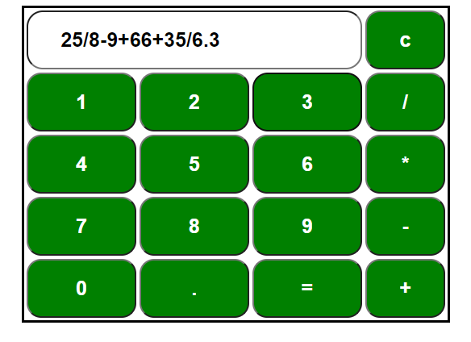

# Calculator
A simple front-end project. It can calculate simple mathematical expressions involving addition, subtraction, multiplication and division.**Third-party libraries are used to evaluate mathematical expressions.**
# Demo
